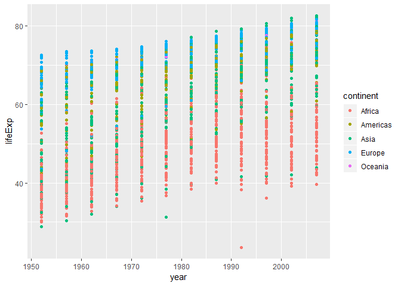
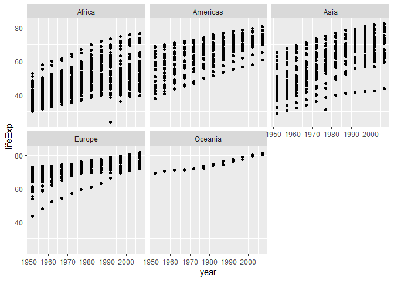
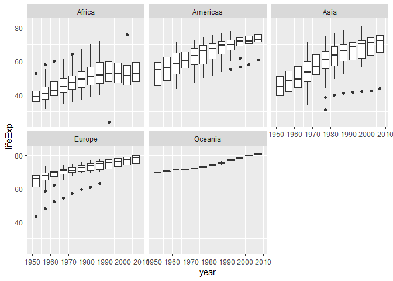
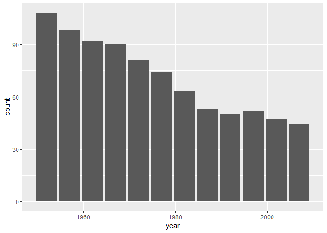
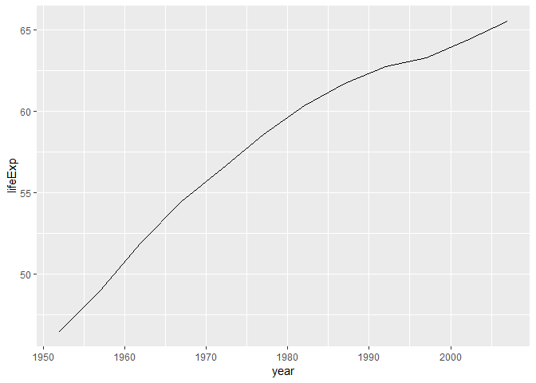
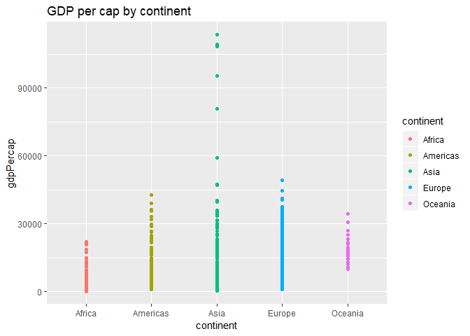

HW03
================

First I will bring in my data and load my packages

``` r
library(gapminder)
library(tidyverse)
```

    ## -- Attaching packages ----------------------------------------------------- tidyverse 1.2.1 --

    ## v ggplot2 3.0.0     v purrr   0.2.5
    ## v tibble  1.4.2     v dplyr   0.7.6
    ## v tidyr   0.8.1     v stringr 1.3.1
    ## v readr   1.1.1     v forcats 0.3.0

    ## -- Conflicts -------------------------------------------------------- tidyverse_conflicts() --
    ## x dplyr::filter() masks stats::filter()
    ## x dplyr::lag()    masks stats::lag()

``` r
library(ggplot2)
```

I’m going to focus on gdpPercap and get some more information like min
and max per continent.

``` r
gapminder %>%
  group_by(continent) %>% 
  summarize(min = min(gdpPercap),
            max = max(gdpPercap))
```

    ## # A tibble: 5 x 3
    ##   continent    min     max
    ##   <fct>      <dbl>   <dbl>
    ## 1 Africa      241.  21951.
    ## 2 Americas   1202.  42952.
    ## 3 Asia        331  113523.
    ## 4 Europe      974.  49357.
    ## 5 Oceania   10040.  34435.

I can see that Asia has the highest gdpPercap and Africa has the lowest.

Now I will look at the spread within each continent by looking at
attributes like variance and standard deviation

``` r
gapminder %>%
  group_by(continent) %>% 
  summarize(var = var(gdpPercap),
            sd = sd(gdpPercap))
```

    ## # A tibble: 5 x 3
    ##   continent        var     sd
    ##   <fct>          <dbl>  <dbl>
    ## 1 Africa      7997187.  2828.
    ## 2 Americas   40918591.  6397.
    ## 3 Asia      197272506. 14045.
    ## 4 Europe     87520020.  9355.
    ## 5 Oceania    40436669.  6359.

Now I will calculate at trimmed mean for lifeExp by year. I will trim
the data removing 10% of the extreme values

``` r
gapminder %>% 
  group_by(year) %>% 
  summarize(mean_lifeExp = mean(lifeExp, trim = .10))
```

    ## # A tibble: 12 x 2
    ##     year mean_lifeExp
    ##    <int>        <dbl>
    ##  1  1952         48.6
    ##  2  1957         51.3
    ##  3  1962         53.6
    ##  4  1967         55.9
    ##  5  1972         58.0
    ##  6  1977         60.1
    ##  7  1982         62.1
    ##  8  1987         63.9
    ##  9  1992         65.2
    ## 10  1997         66.0
    ## 11  2002         66.7
    ## 12  2007         68.1

Now I will look at how life expectancy is chaning over time between the
continents

``` r
gapminder %>% 
  group_by(continent, year) 
```

    ## # A tibble: 1,704 x 6
    ## # Groups:   continent, year [60]
    ##    country     continent  year lifeExp      pop gdpPercap
    ##    <fct>       <fct>     <int>   <dbl>    <int>     <dbl>
    ##  1 Afghanistan Asia       1952    28.8  8425333      779.
    ##  2 Afghanistan Asia       1957    30.3  9240934      821.
    ##  3 Afghanistan Asia       1962    32.0 10267083      853.
    ##  4 Afghanistan Asia       1967    34.0 11537966      836.
    ##  5 Afghanistan Asia       1972    36.1 13079460      740.
    ##  6 Afghanistan Asia       1977    38.4 14880372      786.
    ##  7 Afghanistan Asia       1982    39.9 12881816      978.
    ##  8 Afghanistan Asia       1987    40.8 13867957      852.
    ##  9 Afghanistan Asia       1992    41.7 16317921      649.
    ## 10 Afghanistan Asia       1997    41.8 22227415      635.
    ## # ... with 1,694 more rows

Since this is difficult to visualize I will try a few graphs to make it
easier to see.

``` r
gapminder %>% 
  ggplot(aes(year, lifeExp)) +
  geom_point(aes(color=continent))
```

<!-- -->
This kind of works but lets see if something can work better.

``` r
gapminder %>% 
  ggplot(aes(year,lifeExp)) +
  geom_point()+
  facet_wrap( ~ continent)
```

<!-- -->
It is easier to visualize the trends this way. Maybe summarizing the
data in a box plot will look even better.

``` r
gapminder %>% 
  ggplot(aes(year,lifeExp)) +
  geom_boxplot(aes(group=year))+
  facet_wrap( ~ continent)
```

<!-- -->
I think this is the best plot because it shows a good summary of lifeExp
for each continent over the year and is clear and easy to understand.

Now I will look at low life expectancy by country over time. First, I
will calculate the world wide median than count how many countries have
a life expectancy lower than the median for each year.

``` r
a <- gapminder %>% 
  summarize(median(lifeExp))
print(a)
```

    ## # A tibble: 1 x 1
    ##   `median(lifeExp)`
    ##               <dbl>
    ## 1              60.7

The overall median is 60.7125. I will assign this value to variable a.

``` r
below_median_life_expectancy <- gapminder %>% 
  group_by(country, year) %>% 
  filter(lifeExp < a) %>% select(c(country,year))

below_median_life_expectancy %>% ggplot(aes(x=year)) + geom_bar()
```

<!-- -->
Now I will do some exploration to find a country with an intersting
story. I think a country with a samll population could be interesting so
I will try to find a country with the smallest average population

``` r
gapminder %>%
  group_by(country) %>% 
  mutate(min = min(pop)) %>%
  arrange(min)
```

    ## # A tibble: 1,704 x 7
    ## # Groups:   country [142]
    ##    country               continent  year lifeExp    pop gdpPercap   min
    ##    <fct>                 <fct>     <int>   <dbl>  <int>     <dbl> <dbl>
    ##  1 Sao Tome and Principe Africa     1952    46.5  60011      880. 60011
    ##  2 Sao Tome and Principe Africa     1957    48.9  61325      861. 60011
    ##  3 Sao Tome and Principe Africa     1962    51.9  65345     1072. 60011
    ##  4 Sao Tome and Principe Africa     1967    54.4  70787     1385. 60011
    ##  5 Sao Tome and Principe Africa     1972    56.5  76595     1533. 60011
    ##  6 Sao Tome and Principe Africa     1977    58.6  86796     1738. 60011
    ##  7 Sao Tome and Principe Africa     1982    60.4  98593     1890. 60011
    ##  8 Sao Tome and Principe Africa     1987    61.7 110812     1517. 60011
    ##  9 Sao Tome and Principe Africa     1992    62.7 125911     1429. 60011
    ## 10 Sao Tome and Principe Africa     1997    63.3 145608     1339. 60011
    ## # ... with 1,694 more rows

I’m going to investigate Sao Tome and Principe. Instead of typing that
out repeatedly I wil first assign it a nickname

``` r
STP <- "Sao Tome and Principe"
```

NOw I will look at the comparison between min and max pop

``` r
gapminder %>% 
  summarize(STP, min(pop),
            max(pop),
            var(pop))
```

    ## # A tibble: 1 x 4
    ##   STP                   `min(pop)` `max(pop)` `var(pop)`
    ##   <chr>                      <dbl>      <dbl>      <dbl>
    ## 1 Sao Tome and Principe      60011 1318683096    1.13e16

That seems to be a very broad distribution. I will try to plot the data
to see if there are any trends over time.

``` rlinegraph_popvstime
gapminder %>%
  filter(country == STP) %>% 
  ggplot(aes(year, pop)) +
  geom_line()
  
```

It looks like the population steadily increased over the years. I will
see if LifeExp follows the same trend

``` r
gapminder %>%
  filter(country == STP) %>% 
  ggplot(aes(year, lifeExp)) +
  geom_line()
```

<!-- -->

It does follow a somewhat similar trend in that it increases greatly
over the years.

I will try the extra exercises.

``` r
gtbl <- tbl_df(gapminder)
ggplot(gtbl, aes(x = continent, y = gdpPercap, color = continent)) +
  geom_point() + (ggtitle("GDP per cap by continent"))
```

<!-- -->

I have the plot but I am not sure why the table did not work
